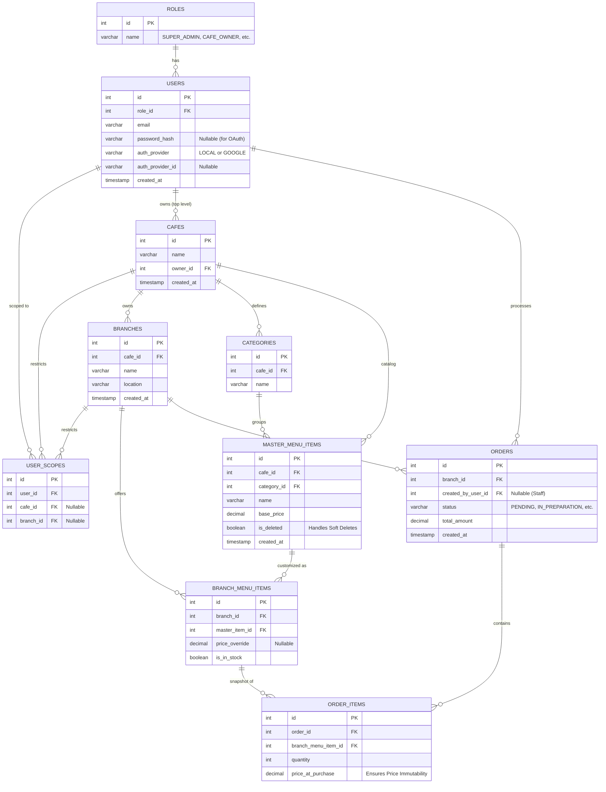

# Entity Relationship Diagram (ERD)

This diagram reflects the latest database schema, including the updates made to support both local passwords and Google OAuth.

```mermaid
erDiagram
    ROLES {
        int id PK
        varchar name "SUPER_ADMIN, CAFE_OWNER, etc."
    }
    
    USERS {
        int id PK
        int role_id FK
        varchar email
        varchar password_hash "Nullable (for OAuth)"
        varchar auth_provider "LOCAL or GOOGLE"
        varchar auth_provider_id "Nullable"
        timestamp created_at
    }

    USER_SCOPES {
        int id PK
        int user_id FK
        int cafe_id FK "Nullable"
        int branch_id FK "Nullable"
    }

    CAFES {
        int id PK
        varchar name
        int owner_id FK
        timestamp created_at
    }

    BRANCHES {
        int id PK
        int cafe_id FK
        varchar name
        varchar location
        timestamp created_at
    }

    CATEGORIES {
        int id PK
        int cafe_id FK
        varchar name
    }

    MASTER_MENU_ITEMS {
        int id PK
        int cafe_id FK
        int category_id FK
        varchar name
        decimal base_price
        boolean is_deleted "Handles Soft Deletes"
        timestamp created_at
    }

    BRANCH_MENU_ITEMS {
        int id PK
        int branch_id FK
        int master_item_id FK
        decimal price_override "Nullable"
        boolean is_in_stock
    }

    ORDERS {
        int id PK
        int branch_id FK
        int created_by_user_id FK "Nullable (Staff)"
        varchar status "PENDING, IN_PREPARATION, etc."
        decimal total_amount
        timestamp created_at
    }

    ORDER_ITEMS {
        int id PK
        int order_id FK
        int branch_menu_item_id FK
        int quantity
        decimal price_at_purchase "Ensures Price Immutability"
    }

    ROLES ||--o{ USERS : "has"
    USERS ||--o{ USER_SCOPES : "scoped to"
    USERS ||--o{ CAFES : "owns (top level)"
    CAFES ||--o{ USER_SCOPES : "restricts"
    BRANCHES ||--o{ USER_SCOPES : "restricts"
    
    CAFES ||--o{ BRANCHES : "owns"
    CAFES ||--o{ CATEGORIES : "defines"
    CAFES ||--o{ MASTER_MENU_ITEMS : "catalog"
    CATEGORIES ||--o{ MASTER_MENU_ITEMS : "groups"
    
    MASTER_MENU_ITEMS ||--o{ BRANCH_MENU_ITEMS : "customized as"
    BRANCHES ||--o{ BRANCH_MENU_ITEMS : "offers"
    
    BRANCHES ||--o{ ORDERS : "receives"
    USERS ||--o{ ORDERS : "processes"
    ORDERS ||--o{ ORDER_ITEMS : "contains"
    BRANCH_MENU_ITEMS ||--o{ ORDER_ITEMS : "snapshot of"
```
