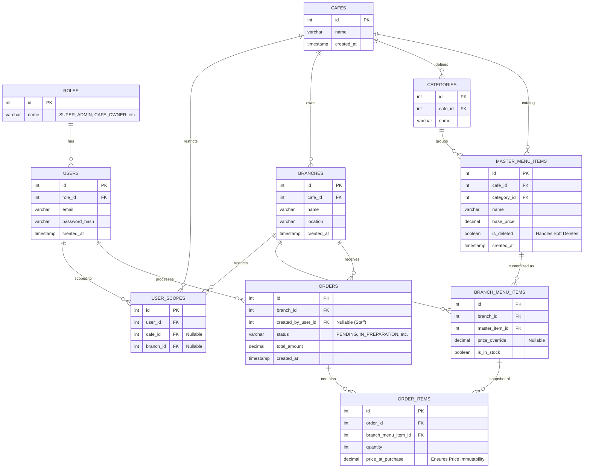

# Database Design & Entity Relationship Diagram (ERD)

This implementation plan outlines the database architecture for the Multi-Branch Café Management System, specifically addressing Task 1 requirements. The proposed schema is designed for PostgreSQL and normalizes entities while strictly adhering to the business rules and architectural edge cases.

## User Review Required

> [!IMPORTANT]
> Please review the proposed database schema and the Mermaid ERD below. Pay special attention to how we handle soft deletes and tenant isolation. 
> Let me know if you approve this schema or if there are any specific fields or constraints you'd like to add before we generate the actual SQL scripts.

## Open Questions

> [!CAUTION]
> 1. **Authentication:** Will you be using an external identity provider (like Firebase Auth or Auth0) where we just store an external `auth_id`, or should we store `password_hash` directly in our `Users` table? (The current plan assumes storing passwords).
> 2. **Branch Manager/Staff Scope:** Should a single user be able to manage *multiple* branches, or is it strictly a 1-to-1 relationship for Branch Managers? (Current plan allows a user to map to specific branches via a join table for flexibility).

## Proposed Schema Design

The schema is divided into 5 core domains as requested.

### 1. Users & Roles (RBAC)
*   **Roles:** Defines the available system roles (`SUPER_ADMIN`, `CAFE_OWNER`, `BRANCH_MANAGER`, `STAFF`).
*   **Users:** Stores user credentials and profile information.
*   **User_Scopes:** A mapping table that defines exactly which `cafe_id` or `branch_id` a user has access to, based on their role. This ensures strict Tenant Data Isolation.

### 2. Cafes & Branches
*   **Cafes:** The top-level tenant entity for a café franchise.
*   **Branches:** Physical locations belonging to a specific Café.

### 3. Master Menu & Categories
*   **Categories:** Menu categories (e.g., Beverages, Pastries) scoped to a Café.
*   **Master_Menu_Items:** The global catalog of items for a Café. Includes a `is_deleted` flag for **Soft Deletes**.

### 4. Branch Menu Items
*   **Branch_Menu_Items:** Links a `Master_Menu_Item` to a specific `Branch`. This holds the `price_override` and `is_in_stock` (availability toggle). If a branch doesn't override the price, it falls back to the master price.

### 5. Orders & Transactional State
*   **Orders:** Tracks the order lifecycle with strict statuses (`PENDING`, `IN_PREPARATION`, `COMPLETED`, `CANCELLED`).
*   **Order_Items:** The line items of an order. Crucially, this table stores the `price_at_purchase` to guarantee **Price Immutability**. Even if master or branch prices change later, historical receipts remain perfectly accurate.

---

## Entity Relationship Diagram (ERD)

## Addressing Architectural Edge Cases

1.  **Price Immutability:** Achieved by storing `price_at_purchase` directly on the `Order_Items` table. Historical queries will SUM this column rather than joining back to the live menu pricing.
2.  **Soft Deletes & Integrity:** `Master_Menu_Items` uses an `is_deleted` boolean flag. This removes it from active catalogs but preserves the foreign key integrity for old `Order_Items` that reference it via `Branch_Menu_Items`.
3.  **Tenant Data Isolation:** The `cafe_id` is propagated to `Branches`, `Categories`, and `Master_Menu_Items`. Using the `User_Scopes` table, a middleware can enforce that a user can only interact with entities where `entity.cafe_id == user_scope.cafe_id`.

## Next Steps upon Approval
1. Generate the raw PostgreSQL schema (`schema.sql`) with all `CREATE TABLE`, foreign keys, indexes, and constraints.
2. Provide a sample data seed file (optional, but good for testing).
